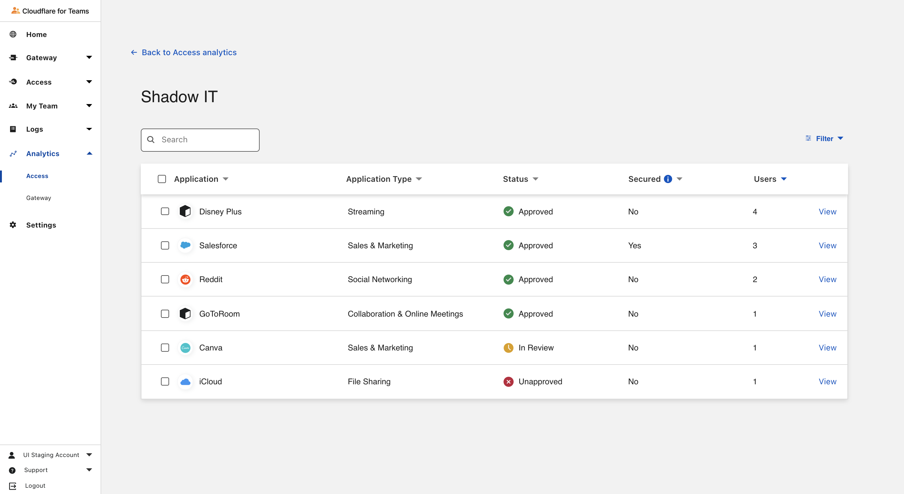
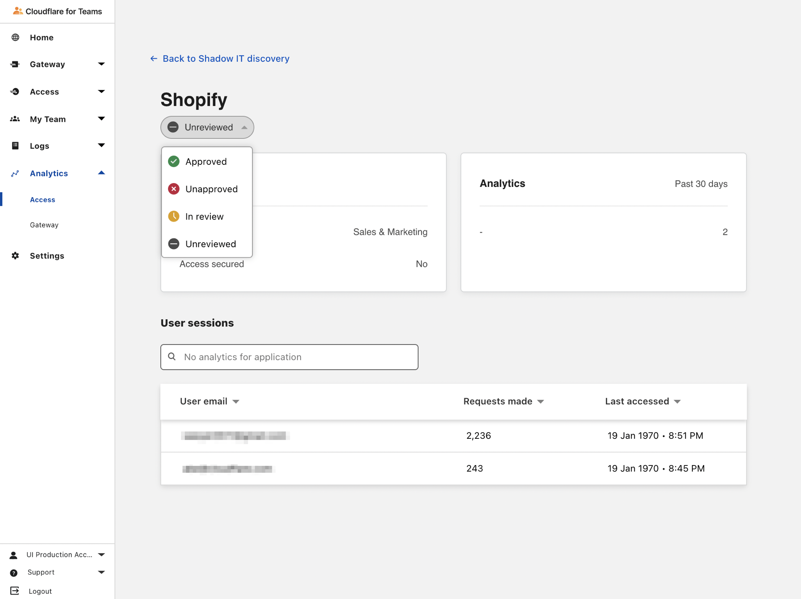

# Shadow IT Discovery

The Teams Shadow IT Discovery page gives you visibility over which SaaS applications your end users are visiting. This information enables you to create the appropriate Zero Trust or Secure Web Gateway policies in Cloudflare for Teams, so that you can have control over the security of your users and data.

On the Shadow IT Discovery page, you can gather information on the [application status](#application-status) and [application type](#application-type) of the applications visited by your users. You can also change an application's status according to your organization's preferences. The page also gives you an overview of metrics such as who your top connected users are, how many applications have been accessed, or how many application logins have failed over a certain period of time.

Shadow IT Discovery can be found under **Analytics > Access**.

## Shadow IT view

To see an in-depth breakdown of SaaS applications your users have visited, click on **Review all** in the **Shadow IT Discovery** chart. From this page, you can search for a specific application, or you can click **View** to see a full profile for that application.

- **Application**. This field shows each SaaS application's name and logo.
- **Application type**. This field shows the [application type](/policies/filtering/http-policies/application-app-types#app-types) Teams has assigned to each application.
- **Application status**. This field shows an [application's status](#application-status).
- **Secured**. This field shows whether the application is currently secured behind Access.
- **Users**. This field shows how many users have connected to the application over the period of time you have specified in the Shadow IT Discovery overview page.

## Application status

Within Shadow IT Discovery, applications are labeled according to their status. Your organization can determine the status of each application, and decide to change it at any point in time. This is a list of possible values for the status field:

<TableWrap>

| Status         | Description                                                                                            |
| -------------- | ------------------------------------------------------------------------------------------------------ |
| **Approved**   | Applications that have been marked as sanctioned by your organization.                                 |
| **Unapproved** | Applications that have been marked as unsanctioned by your organization.                               |
| **In review**  | Applications in the process of being reviewed by your organization.                                    |
| **Unreviewed** | Unknown applications that are neither sanctioned nor being reviewed by your organization at this time. |

</TableWrap>

### Change an application's status

You may need to update an application's status based on your organization's preferences. To change an application's status:

1. From the **Application profile** view, click the status button under the application name.

   

1. Select the status you want to assign to your application.

The application's status will now be updated across charts and visualizations within Shadow IT Discovery.

### Change the status for multiple applications

To change the status of multiple applications to Approved, Unapproved, In review or Unreviewed at the same time:

1. From the **Shadow IT view**, select the checkboxes of all applications for which you would like to change the status.

1. Click **Update Status**.

1. Select the status you want to assign to your applications.

Each application's status will now be updated across charts and visualizations within Shadow IT Discovery.