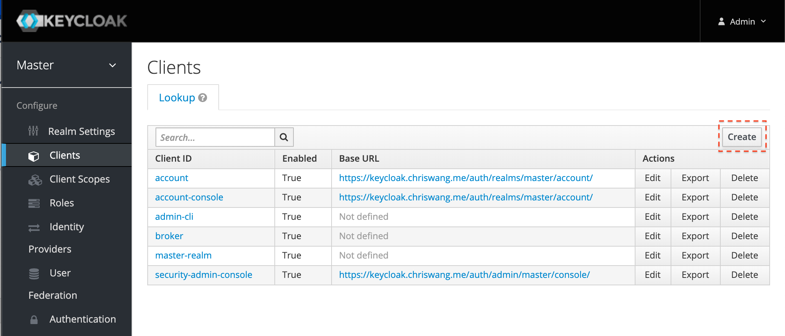
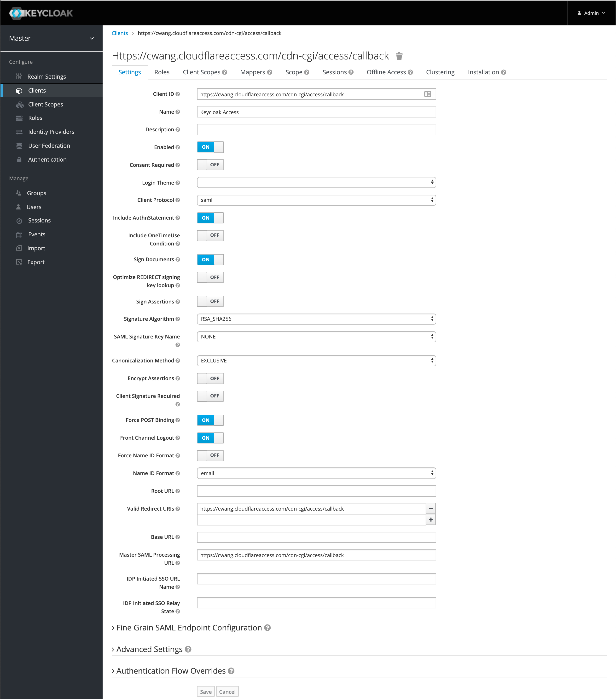

# SAML | Keycloak

Keycloak is an open source identity and access management solution built by JBoss. Need a Keycloak lab environment for testing? An example is available [here](https://github.com/mw866/tunnel-keycloak).

## Set up Keycloak (SAML)

To set up Keycloak (SAML) as your identity provider:

1. In Keycloak, select **Clients** in the navigation bar and create a new client.

   

1. Under **Client ID**, enter your [team domain](/glossary#team-domain) followed by this callback at the end of the path: `/cdn-cgi/access/callback`. For example:

   ```txt
   https://<your-team-name>.cloudflareaccess.com/cdn-cgi/access/callback
   ```

   

1. Change the `Name ID Format` to `email`

1. Next, set the valid redirect URI to the Keycloak domain that you are using. For example, `https://<your-team-name>.cloudflareaccess.com/cdn-cgi/access/callback`.

1. Set the Master SAML Processing URL using the same Keycloak domain: `https://<keycloak_domain>/auth/realms/master/protocol/saml`.

1. If you wish to enable client signatures, enable `Client Signature Required` and click save.

   1. You will need to [follow the steps here to get the certificate and enable it in the Cloudflare dashboard](/identity/idp-integration/signed_authn).

   1. Import the Access certificate you downloaded into the `SAML Keys` tab. Use `Certificate PEM` as the format.

1. Set the built-in protocol mapper for the `email` property.

   

   Next, you will need to integrate with Cloudflare Access.

1. On the Teams dashboard, navigate to **Settings > Authentication**.

1. Under **Login methods**, click **Add new**.

1. Choose **SAML** on the next page.

   You will need to input the Keycloak details manually. The examples below should be replaced with the specific domains in use with Keycloak and Cloudflare Access.

   | Field                       | Example                                                            |
   | --------------------------- | ------------------------------------------------------------------ |
   | Single Sign-On URL          | `https://<keycloak_domain>/auth/realms/master/protocol/saml`       |
   | IdP Entity ID or Issuer URL | `https://<unique_id>.cloudflareaccess.com/cdn-cgi/access/callback` |
   | Signing certificate         | Use the X509 Certificate in the Realm Settings from Keycloak       |

1. Click **Save**.

To test that your connection is working, navigate to **Authentication > Login methods** and click **Test** next to the login method you want to test.
