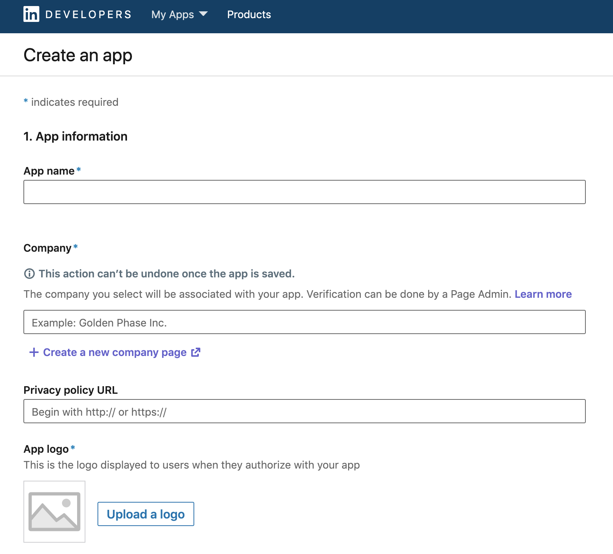
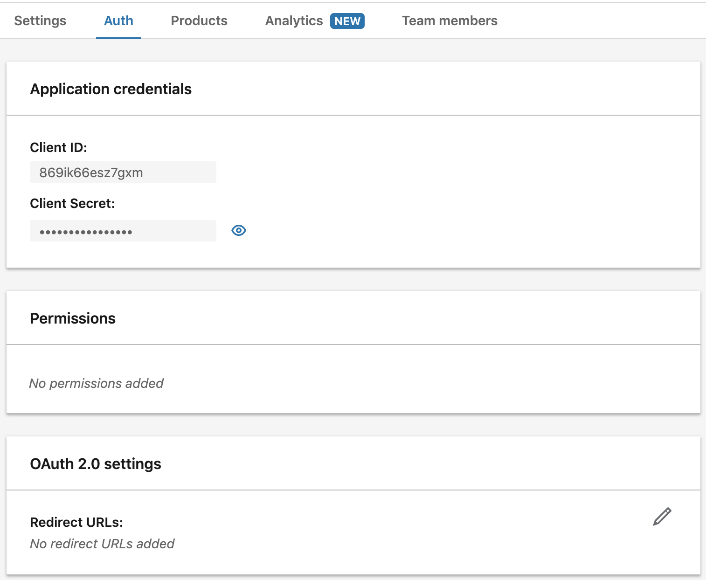

# LinkedIn

Cloudflare Access allows your users to use LinkedIn as their identity provider (IdP).

## Set up LinkedIn as an IdP

Configuring LinkedIn as a Cloudflare Access IdP requires a LinkedIn account.

To configure LinkedIn as an IdP:

1.  Go to [the LinkedIn Developer Portal](https://www.linkedin.com/developers).

2.  Click **Create App**.

    

3.  Sign in to your LinkedIn account. The **Create an app** screen displays.

    

4.  Enter an **App name** for your application.

5.  Enter the URL for your business page.

6.  Click **Upload a logo** and navigate to your company logo image file.

7.  Click **OK**.

8.  (optional) Select the **Share on LinkedIn** option to announce that your clients can use LinkedIn to access your app.

    

9.  Select the **Sign In with LinkedIn** option.

10. Click the **API Terms of Use** link to read the terms of use.

11. If you agree to the terms, check the **I have read and agree to these terms** option.

12. Click **Create app**.

13. Go to your account Settings page.

    

14. Click the **Auth** tab.

15. Copy the **Client ID** and **Client Secret**.

16. On the Teams dashboard, navigate to **Settings > Authentication**.

17. Under **Login methods**, click **Add new**.

18. Select **LinkedIn** as your IdP.

19. In the **App ID** and **Client secret** fields, input the **Client ID** and **Client secret** values you've copied from the Application credentials tab in the LinkedIn Developer Portal.

20. Click **Save**.

21. In the **LinkedIn** **Auth** tab, scroll to **OAuth 2.0 settings** and click the **pencil icon** to edit the settings.

    

22. Enter your [team domain](/cloudflare-one/glossary/#team-domain) followed by this callback at the end of the path: `/cdn-cgi/access/callback`. For example:

    ```txt
    https://<your-team-name>.cloudflareaccess.com/cdn-cgi/access/callback
    ```

To test that your connection is working, in the Teams dashboard, navigate to **Authentication > Login methods** and click **Test** next to LinkedIn.

## Example API configuration

```json
{
  "config": {
    "client_id": "<your client id>",
    "client_secret": "<your client secret>"
  },
  "type": "linkedin",
  "name": "my example idp"
}
```
