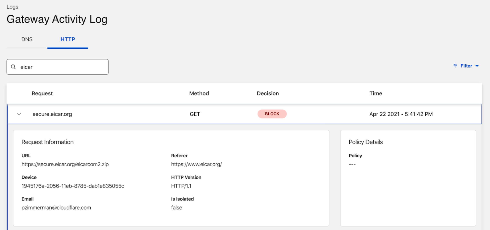

# AV scanning

Cloudflare Gateway protects users as they navigate the Internet. When users download or upload a file to an origin on the Internet, that file could potentially contain malicious code that may cause their device to perform undesired behavior.

To prevent this, Cloudflare Gateway allows admins to enable **Anti-Virus (AV) scanning** of files that are uploaded or downloaded by users as the file passes through Gateway.

AV scanning of files requires organizations to enable Proxy mode under **Settings** > **Network** > **Layer 7 Firewall**.

## Enable AV scanning

To enable AV scanning:

1. On the [Teams Dashboard](https://dash.teams.cloudflare.com), navigate to **Settings > Network**.

1. In the section titled **AV Scanning**, toggle whether to scan files for malicious payloads during uploads, downloads, or both.

When a file is blocked due to the presence of malware, it is logged as a Block decision:

## How Gateway determines if a file should be scanned

If AV scanning is enabled, Gateway will use the following to determine whether a file is present in a request or response, and whether to scan that file (first match will result in the file being scanned):

- If the Content-Disposition HTTP header is `Attachment`
- If the byte signature of the body of the request matches a signature we identify as one of the following file type categories:

  - **Executable** (e.g., `.exe`, `.bat`, `.dll`, `.wasm`)
  - **Documents** (e.g., `.doc`, `.docx`, `.pdf`, `.ppt`, `.xls`)
  - **Compressed** (e.g., `.7z`, `.gz`, `.zip`, `.rar`)

- If the file name in the Content-Disposition header contains a file extension that indicates it is one of the file type categories above

If none of the above conditions trigger a file to be scanned, Gateway will use the origin's Content-Type header to determine whether or not to scan the file. Additionally, Gateway will not scan files it determines to be in the Image, Video, or Audio file type categories.

If a file does not trigger a scan based on the three methods above but also does not match criteria to be exempted from scanning, Gateway will default to scanning the file for malware.

## Non-scannable files

Not all files are able to be scanned. For example, this is the case for password protected files that cannot be opened due to encryption. Admins can choose whether to **fail open** (allow the file to pass through unscanned) or to **fail closed** (deny the file transfer).

The following files cannot be scanned and will be blocked or allowed based on whether the admin configured Gateway to fail open or closed:

- Files larger than 15MB cannot be scanned.
- Password protected archives
- Archives with more than 3 recursion levels
- Archives with more than 300 files
- PGP encrypted files

## Opt content out from scanning

When an admin enables AV scanning for uploads and/or downloads, Gateway will scan every supported file. Admins can selectively choose to disable scanning by leveraging the HTTP rules. All [HTTP selectors](https://developers.cloudflare.com/cloudflare-one/policies/filtering/http-policies#selectors) can be used to opt HTTP traffic out from AV scanning using the Do Not Scan action. For example, to prevent AV scanning of files uploaded to or downloaded from `example.com`, an admin would configure the following rule:

| Selector | Operator      | Value           | Acton       |
| -------- | ------------- | --------------- | ----------- |
| Hostname | Matches Regex | `.*example.com` | Do Not Scan |

Opting out of AV scanning applies to both uploads and downloads of files (i.e., it matches the global AV scanning setting). If an admin has chosen, for example, to only globally scan uploads, then opting out of AV scanning only applies to uploads.

## Supported compressed file types

In addition to standard object files like PDFs, the following archive types are supported for AV scanning:

- ARJ
- ZIP
- GZIP compressed files
- TAR
- Self-extracting ARJ
- Self-extracting ZIP
- UUE and XXE compressed files
- LZH/LHA
- Self-extracting LZH/LHA
- ZOO
- MIME base64
- Microsoft TNEF
- MSCOMPRESS
- Microsoft CAB
- Self-extracting CA
- RAR
- Self-extracting RAR
- Java ARchive
- Binhex (Mac)
- BZ2
- ACE
- ACE SFX
- BASE64
- PGP signed message, document, etc.
- MacBinary
- CHM Help Files
- CPIO SVR4
- RPM
- NSIS Nullsoft Installer
- 7-Zip
- 7-Zip SFX
- AutoIt
- SAPCar
- Inno Setup
- eXtensible ARchive format (XAR)
- XZ file format
- AutoHotkey
- Smart Install Maker
- Chrome Extension (CRX) Package Format
- Office Legacy XML
- Indigo Rose Setup Factory
- ISO 9660
- Windows Imaging File (WIM)