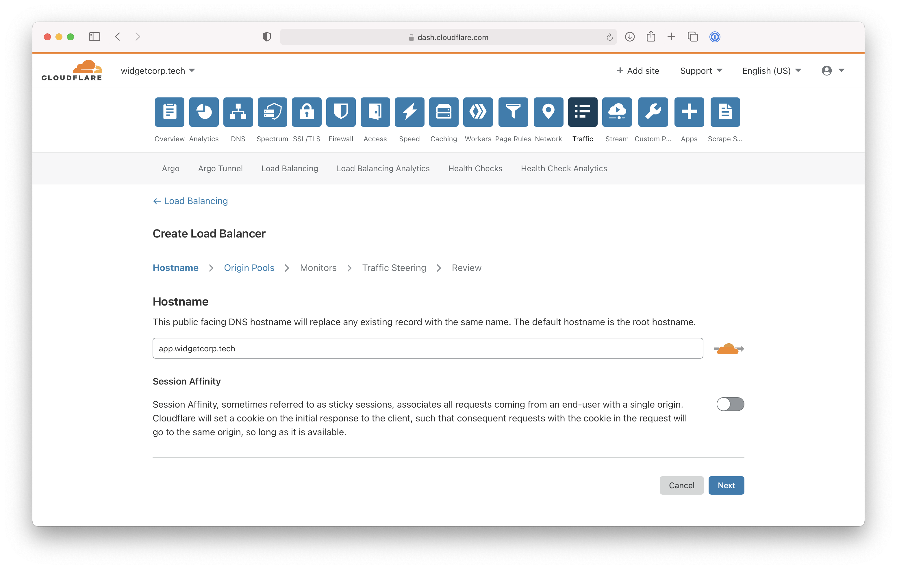
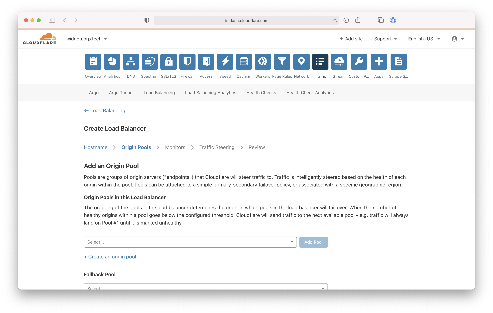
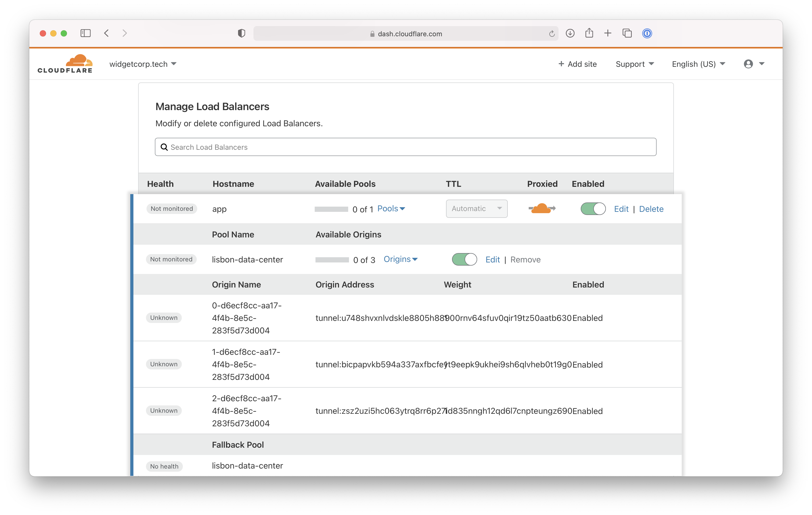
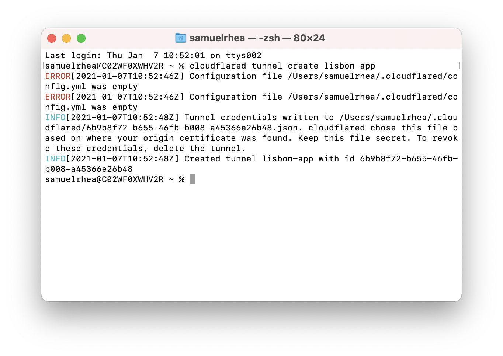
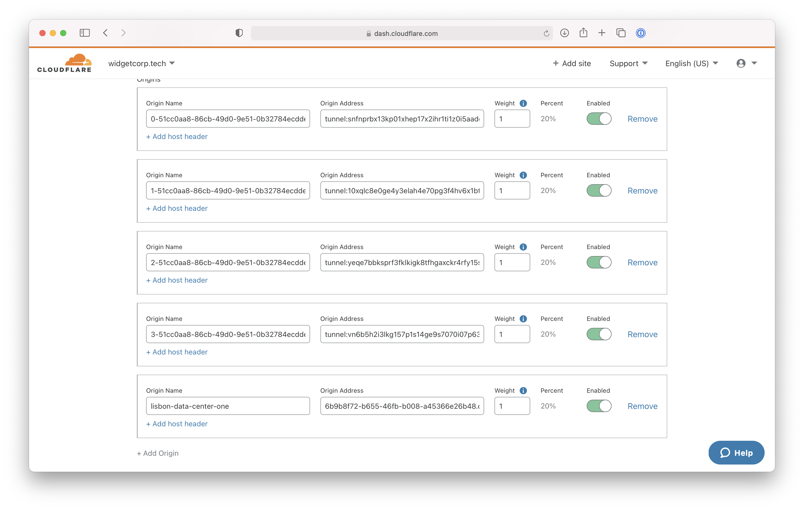

# Migrate to Named Tunnels with Load Balancer

Cloudflare Tunnel is available in two deployment modes: "Legacy" Tunnel and "Named" Argo Tunnel. [Named Tunnel](https://blog.cloudflare.com/argo-tunnels-that-live-forever/) mode improves maintainability and stability by distinguishing between routing and configuration.

Unlike Legacy mode, Named Argo Tunnels give users the ability to manage routing in the Cloudflare dashboard and to run `cloudflared` once for [multiple services](https://blog.cloudflare.com/many-services-one-cloudflared/).

If you are using Legacy Argo Tunnel today you can migrate to Named Argo Tunnel deployment in less than 10 minutes.

**🗺️ This tutorial covers how to:**

- Migrate a Legacy Argo Tunnel deployment to Named Argo Tunnel model
- Use Cloudflare Load Balancer to perform a zero downtime migration

**⏲️ Time to complete:**

10 minutes

See additional documentation for working with [Kubernetes](/connections/connect-apps/routing-to-tunnel/kubernetes).

---

## Creating a Legacy Argo Tunnel with Cloudflare Load Balancer

This tutorial starts by documenting the steps to create a Legacy Argo Tunnel with Cloudflare Load Balancer so that those can be compared to the migration steps. If you would prefer to start the migration now, please [skip ahead](#create-a-named-tunnel).

In both modes, the first step is to create a Load Balancer and Origin Pool. Navigate to the `Traffic` tab of the Cloudflare dashboard. Input a public-facing DNS hostname for a domain in your Cloudflare account.



Next, create an origin pool for the load balancer. This will be a group of origins, whether Argo Tunnel connections or traditional IP addresses, used by the load balancer.



In Legacy mode, adding a new instance of `cloudflared` into a Load Balancer pool must be done from the command line tool itself. The `cloudflared` agent will start and create 4 separate connections, enrolling each of these into a load balancer pool.

```sh
$ cloudflared tunnel --hostname app.widgetcorp.tech --url http://localhost:8000 --lb-pool lisbon-data-center
```



However, the Legacy Argo Tunnel mode has some downsides, including:

- You cannot manage these connections from the Cloudflare dashboard.
- When `cloudflared` restarts, it will attempt to register these connections as new connections which can lead to service disruption.

The Named Tunnel, documented below, model provides easier management and greater stability.

## Create a Named Tunnel

To migrate to the Named Tunnel model, first [download and authenticate](/connections/connect-apps) `cloudflared`. Install the agent within your environment in a location that can reach the service you plan to connect to Cloudflare.

To begin, create a Named Tunnel with the following command.

```sh
$ cloudflared tunnel create lisbon-app
```



This command will create a Tunnel object in your Cloudflare account that is represented by this instance of `cloudflared`. You can point DNS records or LB records to this connection when you run the Tunnel.

## Create a configuration file

Next, configure your Tunnel. The example below consists of a web service that is available at port 8000. The ingress rule will send traffic that `cloudflared` receives for the specified hostname to that port. You can also connect [multiple service](/tutorials/multi-origin) with a single instance of `cloudflared`.

In the configuration file, you must specify the location of the credentials file generated previously when you created the Tunnel.


You can save the configuration file.

## Run the Tunnel

You can now run the Tunnel. Running the Tunnel will connect `cloudflared` to Cloudflare's edge in a connection only available to your account. You can use the Tunnel ID value to treat that connection like the IP address of an origin, without the risk of someone reaching it directly and bypassing Cloudflare.

Run the following command, replacing `lisbon-app` with the name of your Tunnel.

```sh
$ cloudflared tunnel run lisbon-app
```


## Migrate the Load Balancer configuration

You can now begin migrating your Load Balancer deployment to use the new Named Tunnel. Create a new Origin Pool in the Load Balancer. Add a new origin to the list.

In the origin address field, input the ID of the tunnel followed by `cfargotunnel.com`. In this example, the origin address value would be `6b9b8f72-b655-46fb-b008-a45366e26b48.cfargotunnel.com`.



Wait 1 minute while the new origin is recognized as healthy by Cloudflare Load Balancer. Once healthy, you can begin to disable the Legacy Argo Tunnel origins from the legacy Load Balancer pool.