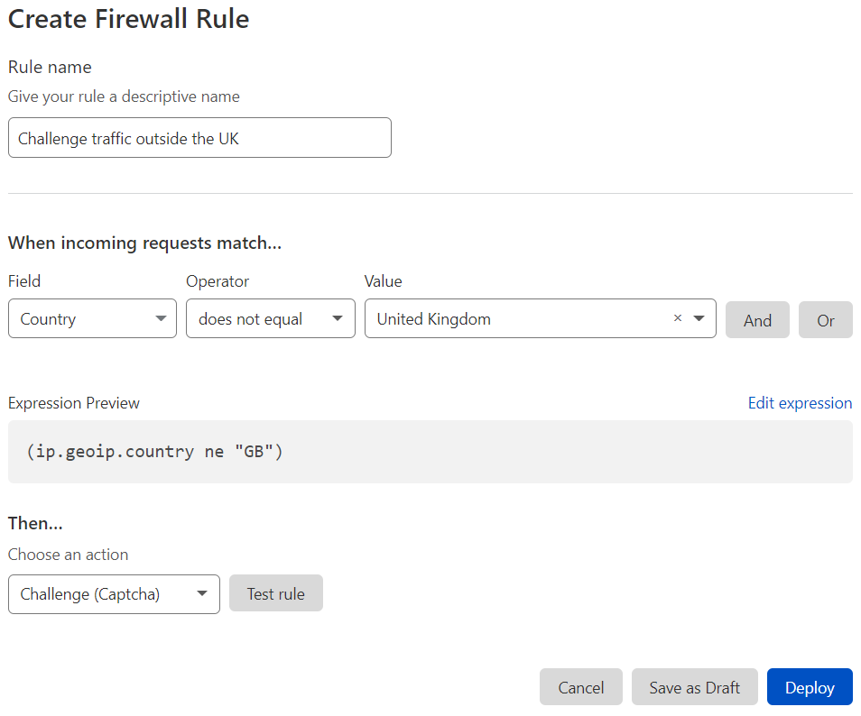
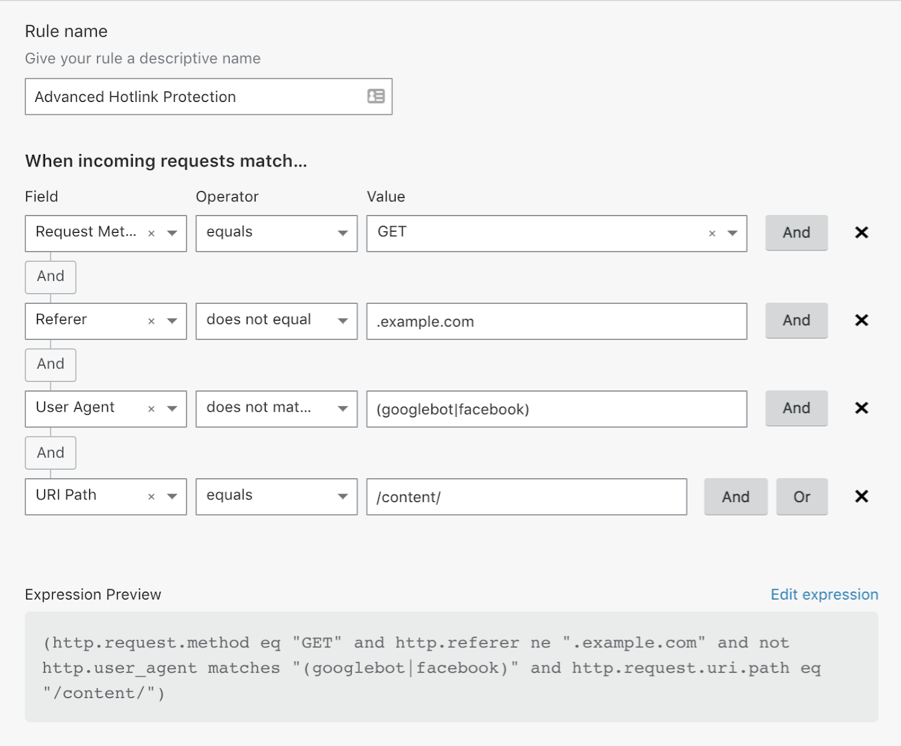

# Fields and expressions

## Overview

Every Cloudflare firewall rule, no matter how complex, is really just a combination of two elements: an **expression** and an **action**. Expressions define the criteria for an HTTP request to trigger an action; the action tells Cloudflare what to do with that request.

When an HTTP request reaches the firewall, Cloudflare compares values from the request to those defined in the expression. If the expression returns `true`, the expression matches, and Cloudflare triggers the action for that rule.

## Working with expressions

There are two interfaces in the **Firewall** app for creating expressions: the **Expression Builder** and the **Expression Editor**.

The Expression Builder’s visual interface allows you to build expressions without worrying about field names and syntax.

By comparison, the Expression Editor is text only, but it supports advanced features not available in the builder. You can find both in the **Firewall Rules** tab.

The [_Cloudflare Filters API_](/api/cf-filters) provides an interface for programmatically managing expressions. Use [_Firewall Rules API_](/api/cf-firewall-rules) to combine a filter with an action and deploy a new firewall rule.

## Simple and compound expressions

When working with Firewall Rules, you will encounter two kinds of expressions:

- **Simple expressions** compare a value from an HTTP request to a value defined in the expression. You can identify a simple expression by the presence of a **comparison operator** (_equals, less than_, for example).

- **Compound expressions** combine two or more simple expressions into a single
  expression. You can identify a compound expression by the presence of a **logical operator** (_and_, _or_, for example). Since each firewall rule can only contain a single expression, compound expressions allow you to tailor rules to specific use cases with a high degree of accuracy and precision.

### Simple expressions

Simple expressions are composed of 3 elements:

1. A **field** that represents a property of an HTTP request.
2. A representative **value** for that field, which Firewall Rules will compare with the actual value from the request.
3. A **comparison operator**, which specifies how the value defined in the expression must relate to the actual value from the request for the operator to return `true`.

If the comparison operator returns `true`, the request matches the expression.

This Expression Builder screenshot shows an expression for matching requests that do not originate in the United Kingdom.



Notice how the **Expression Preview** displays the expression in text:

```sql
(ip.geoip.country ne "GB")
```

In this example, `ip.geoip.country` represents the country associated with the requesting client’s IP address, and the value `"GB"` represents the country code to match. The `ne` notation between them represents the _not equal_ comparison operator. Together, the expression specifies a match for any request with a country field value other than `GB`.

Simple expressions use this pattern:

```sql
<field> <comparison operator> <value>
```

For more on creating firewall rules using Cloudflare’s visual builder, see [_Create, edit, and delete rules_](/cf-dashboard/create-edit-delete-rules).

For a list of supported fields and comparison operators, see [_Firewall Rules language_](/cf-firewall-language/).

### Compound expressions

A **compound expression** uses a **logical operator** (_and_, _or_, for example) to combine two or more expressions. Compound expressions are powerful because they allow you to build complex statements within a single expression.

For example, suppose you want to stop other sites from direct linking to your website’s content. To do that, you can build an expression that matches requests to access your content URI, as in this example:

```sql
http.request.uri.path eq "/content/"
```

While this expression will match requests for content, it does not discriminate between internal and external requests. As is, this rule will match every content request, including those referred from our own domain.

To match only external requests for content, use the `and` operator, as in this example:

```sql
http.referer ne ".example.com" and http.request.uri.path eq "/content/"
```

Compound expressions only match requests that satisfy each of the simple expressions within. That is because the logical `and` operator requires that both operands be true for the compound expression to return `true`.

In general, compound expressions use this pattern:

```sql
<expression> <logical operator> <expression>
```

Note that a compound expression can itself be one of the operands of a logical operator. In this way, you can use multiple operators to construct a compound expression from many individual expressions.

Compound expressions are easier to scan when displayed in the Expression Builder’s visual interface, and the Expression Preview is a great reference for learning to write more advanced expressions.



For a list of supported logical operators, see [_Firewall Rules language: Operators_](/cf-firewall-language/operators).
