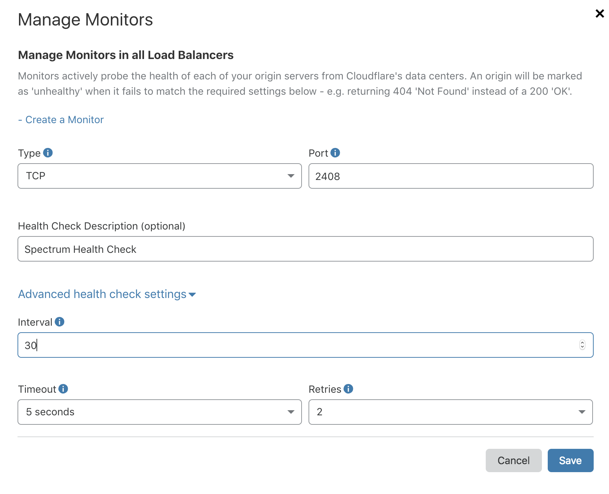

# Cloudflare Load Balancer

You can configure Spectrum and Cloudflare's Load Balancing to provide TCP healthchecks, failover, and traffic steering to bring resiliency to your Spectrum applications. To prevent issues with DNS resolution for a Spectrum application, do not use the same Spectrum hostname as a current Load Balancing hostname.


This feature requires an Enterprise plan. If you would like to upgrade, contact your account team.


## TCP health checks

You can configure Cloudflare's Load Balancer to probe any TCP port for an accepted connection, which is in addition to HTTP and HTTPS probing capabilities.

Health Checks are optional within a Load Balancer. However, without a health check, the load balancer will distribute traffic to all origins in the first pool. With the Health Checks enabled, hosts that have gone into an error state will not receive traffic maintaining uptime. This allows you to enable intelligent failover within a pool of hosts or amongst multiple pools.

The example below shows a TCP health check configuration for an application running on port 2408 with a refresh rate every 30 seconds. You can configure TCP health checks through the dashboard or through Cloudflare's API.

<details>
<summary>
  TCP health check - Dashboard example
</summary>
<div class="special-class" markdown="1">



</div>
</details>

<details>
<summary>
  TCP health check - API example
</summary>
  <div class="special-class" markdown="1">

```bash
curl 'https://api.cloudflare.com/client/v4/organizations/{ORG_ID}/load_balancers/monitors'  \
-H 'Content-Type: application/json' \
-H 'X-Auth-Email: user@example.com' \
-H 'X-Auth-Key: 00000000000' \
-X POST --data '{"description":"Spectrum Health Check","type":"tcp","port":2048,"interval":30,"retries":2,"timeout":5,"method":"connection_established"}'
```

```json
{
  "description": "Spectrum Health Check",
  "type": "tcp",
  "port": 2048,
  "interval": 30,
  "retries": 2,
  "timeout": 5,
  "method": "connection_established"
}
```

</div>
</details>

## Weights

[Origin Weights](/load-balancing/understand-basics/weighted-load-balancing) allow you to have origins without the same capacity or allow you to split traffic amongst hosts for any other reason.

Weight configured within a load balancer pool will be honored with load balancing through Spectrum. If configured, Cloudflare will distribute traffic amongst the available origins within a pool according to the relative weights assigned to each origin.

## Steering modes

All steering modes are available for transport load balancing through Spectrum:

- [Standard failover](/load-balancing/understand-basics/traffic-steering#off---standard-failover): Traffic goes from unhealthy pools to the next healthy pool in your configuration.
- [Dynamic steering](/load-balancing/understand-basics/traffic-steering#dynamic-steering): Traffic goes to the fastest pool for a given user.
- [Geo steering](/load-balancing/understand-basics/traffic-steering#geo-steering): Traffic goes to a specific geographic region or — for Enterprise customers only — specific data centers.
- [Proximity steering](/load-balancing/understand-basics/traffic-steering#proximity-steering): Traffic goes to the closest physical data center.

## Load balancing rules

Currently, you cannot use [load balancing custom rules](/load-balancing/understand-basics/load-balancing-rules) with Cloudflare Spectrum.

For more information about setting up a Load Balancer to use with Spectrum, refer to [Create a Load Balance](/spectrum/how-to/create-load-balancer/).
